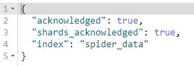
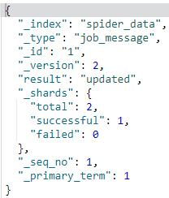
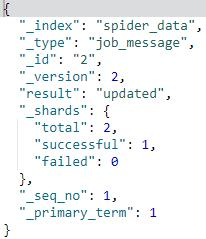
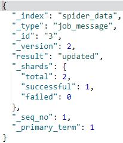
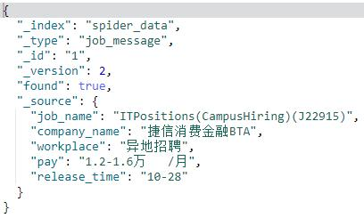
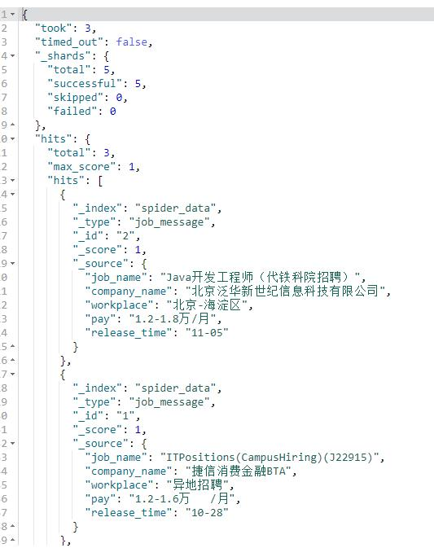
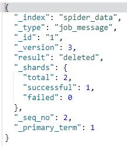
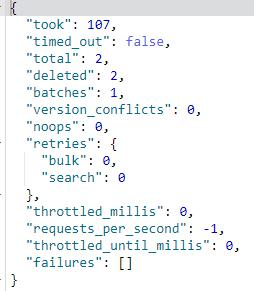

# 1.创建索引
	PUT /spider_data?pretty

# 2.插入数据
	PUT /spider_data/job_message/1?pretty
	{
	    "job_name": "ITPositions(CampusHiring)(J22915)", 
	    "company_name"   : "捷信消费金融BTA",
	    "workplace": "异地招聘",
	    "pay": "1.2-1.6万   /月",
	    "release_time": "10-28"
	}
	PUT /spider_data/job_message/2?pretty
	{
	    "job_name": "Java开发工程师（代铁科院招聘）", 
	    "company_name":    "北京泛华新世纪信息科技有限公司", 
	    "workplace": "北京-海淀区",    
	    "pay": "1.2-1.8万/月", 
	    "release_time": "11-05"
	}
	PUT /spider_data/job_message/3?pretty
	{
	    "job_name": "Java高级开发工程师", 
	    "company_name": "新浪微博",  
	    "workplace": "北京", 
	    "pay": "2-4万/月", 
	    "release_time": "11-05"
	}

# 3.查询数据
#### （1）按id查询
	GET /spider_data/job_message/1

#### （2）按类型查询
	GET /spider_data/job_message/_search

# 4.删除数据
#### （1）按id删除
	DELETE /spider_data/job_message/1

#### （2）按类型删除
	POST /spider_data/job_message/_delete_by_query?conflicts=proceed
	{
	  "query":{
	    "match_all":{}
	  }
	}

