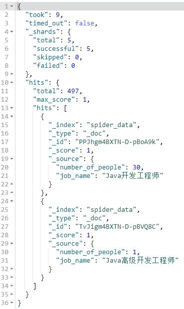
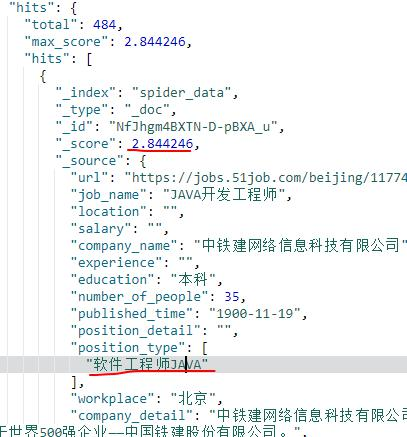
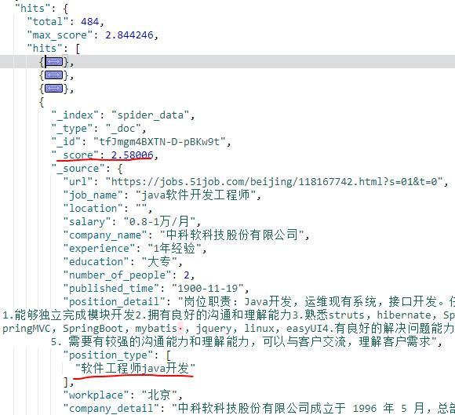
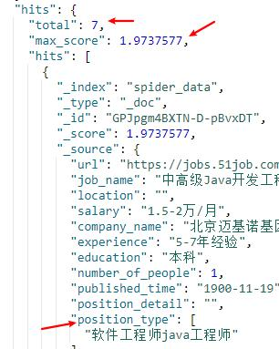
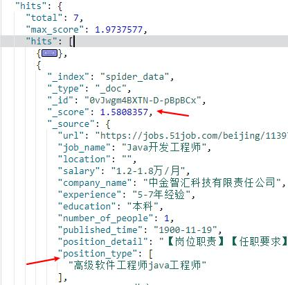
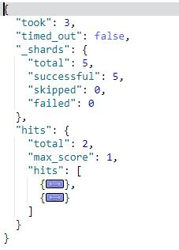
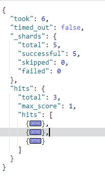
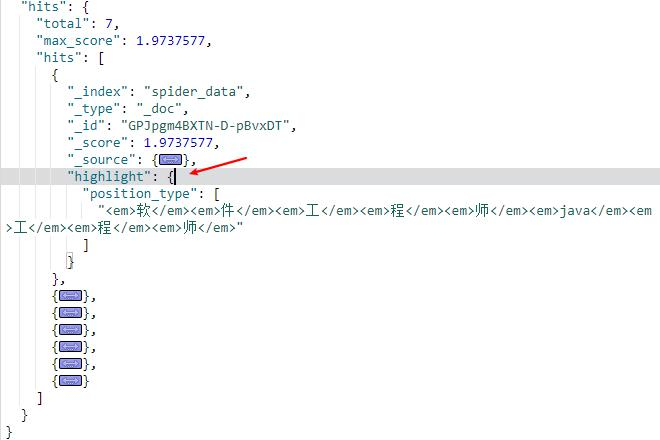

# ES查询
### 1.match_all查询
默认查询方式，可以查询所有文档，默认返回前10条

	POST /spider_data/_search
	
	POST /spider_data/_search
	{
	  "query": {
	    "match_all": {}
	  }
	}
### 2.数据量控制
+ _source:指定查询结果的字段
+ size:控制返回数量
+ from:返回结果从第几条开始 

	查询job_name、number_of_people两个字段，查询两条数据，从第一条开始显示
	POST /spider_data/_search
	{
	  "size": 2,
	  "_source": [
	    "job_name",
	    "number_of_people"
	  ],
	  "from": 1
	}

### 3.match查询（全文搜索）
match查询会对输入内容进行分词，对分词后的结果进行查询，并对自动传入的关键词进行大小写转换。
> 所查询出的结果会按照相关性的得分_score来排序，这也是Elasticsearch与传统数据库区别的一个地方，
> 数据库中的一条记录要么匹配要么不匹配。
	
	查询所有职位类别为软件工程师java工程师的岗位
	POST /spider_data/_search
	{
	  "query": {
		"match": {
		  "position_type": "软件工程师java工程师"
		}
	  }
	}

	
只要职位类别中含"软件工程师java工程师"其中的相关内容的岗位都会查询出来，并按照其相关性（_score）进行排序

### 4.match_parse查询（短语搜索）
match_parse查询，当查询字段定义了分词器时，会先使用分词器对输入进行分词。然后返回满足下列条件的结果：
> match_parse中的所有term都出现在待查询字段中
> 
> 待查询字段中的所有term都必须和match_parse中的顺序一致
	
	
	POST /spider_data/_search
	{
	  "query": {
	    "match_phrase": {
	      "position_type": "软件工程师java工程师"
	    }
	  }
	}	

### 5.query_string查询
类似match_parse查询，区别在于：
> 待查询字段中的所有term无需与查询字段的顺序一致

### 6.term&terms查询
（1）term:对传入的值不做任何处理，完全匹配查询

	POST /spider_data/_search
	{
	  "query": {
		"term": {
		  "number_of_people": 8
		}
	  }
	}

（2）terms:同时对多个值进行查询，只要其中一个值可以完全匹配就返回

	POST /spider_data/_search
	{
	  "query": {
	    "terms": {
	      "number_of_people":[
	        8,
	        9
	        ]
	    }
	  }
	}

### 7.sort排序
	对查询结果按某个字段进行排序
	POST /spider_data/_search
	{
	  "query": {
	    "terms": {
	      "number_of_people":[
	        8,
	        9
	        ]
	    }
	  },
	  "sort": [
	    {
	      "number_of_people": {
	        "order": "desc"
	      }
	    }
	  ]
	}

### 8.highlight，高亮查询
可以将查询出的字段高亮显示，使用条件：
> 该字段必须是query中查询的字段

	POST /spider_data/_search
	{
	  "query": {
	    "match_phrase": {
	      "position_type": "软件工程师java工程师"
	      }
	    },
	  "highlight": {
	    "fields": {
	      "position_type": {}
	    }
	  }
	}

### 9.range查询，查询指定范围
	查询招聘人数大于7，小于9的岗位
	POST /spider_data/_search
	{
	  "query":{
	    "range": {
	      "number_of_people": {
	        "gte": 7,
	        "lte": 9
	      }
	    }
	  }
	}

